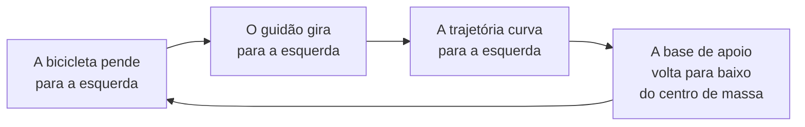

<!--
Aula de exemplo. Serve para mostrar o design system num deck com diagrama (mermaid),
comparação em tabela e um erro conceitual sendo desmontado.
-->

---
layout: roteiro
kicker: Aula 02
title: O caminho de hoje
itens:
  - { tema: A explicação errada, desc: o giroscópio }
  - { tema: O experimento, desc: a bicicleta que não deveria funcionar }
  - { tema: A resposta, desc: direção, não rotação }
  - { tema: O que isso ensina, desc: sobre explicações que parecem boas }
---

---
layout: destaque
kicker: Ponto de partida
title: Uma bicicleta parada cai. A mesma bicicleta, andando, não.
---

<!--
Pergunte antes de explicar. A resposta mais comum será "por causa do giroscópio das rodas".
Anote no quadro. A aula inteira é sobre por que essa resposta, sendo popular e parcialmente
verdadeira, não é a explicação.
-->

---
layout: default
---

# A explicação que todo mundo dá

Uma roda girando resiste a mudar de orientação. Isso é real e se chama **efeito
giroscópico**. Como as rodas giram, a bicicleta se manteria de pé sozinha.

<Termo palavra="Efeito giroscópico" origem="do grego gyros, giro">

A resistência de um corpo em rotação a mudanças na direção do seu eixo. É o que faz um
pião ficar de pé enquanto gira.

</Termo>

<Nota tipo="alerta" titulo="O problema">

A explicação é plausível, usa um conceito real e prevê o resultado certo. Ainda assim, não
é a causa principal. Plausível não é o mesmo que verdadeiro.

</Nota>

---
layout: secao
numero: "01"
title: O experimento
note: A única maneira honesta de testar: construir a bicicleta que a teoria diz que deve cair.
---

---
layout: default
---

# Cancelando o giroscópio

Em 1970, David Jones montou bicicletas com uma **contra-roda** girando ao contrário, na
mesma velocidade — o efeito giroscópico total vira zero.

<Grade :cols="2">
<Cartao rotulo="previsão" titulo="Se a teoria estiver certa">

Sem efeito giroscópico, a bicicleta deveria ser impossível de equilibrar em movimento.

</Cartao>
<Cartao rotulo="resultado" titulo="O que aconteceu" destaque>

Jones andou nela normalmente. Difícil de guiar sem as mãos — mas equilibrar, equilibrou.

</Cartao>
</Grade>

<Citacao autor="David E. H. Jones" fonte="Physics Today, 1970">

Eu queria construir uma bicicleta que não funcionasse. Foi mais difícil do que eu esperava.

</Citacao>

<Fonte>Jones, D. E. H. <em>The stability of the bicycle</em>. Physics Today 23(4), 1970.</Fonte>

<!--
O detalhe metodológico é o coração da aula: Jones não testou se a bicicleta anda. Ele
tentou construir uma que NÃO andasse. Falsificar é mais informativo que confirmar.
-->

---
layout: secao
numero: "02"
title: A resposta
note: Não é a rotação que segura a bicicleta. É a direção.
---

---
layout: default
---

# O ciclo que mantém você de pé

Você não equilibra a bicicleta: você a **dirige** para baixo de si mesmo, dezenas de vezes
por minuto, sem perceber. É a mesma coisa que fazer um cabo de vassoura ficar de pé na
palma da mão.

<!--
A analogia da vassoura é a que faz a ficha cair. Peça para tentarem: ninguém segura a
vassoura parada — todo mundo move a mão para baixo do ponto que está caindo.
-->

---
layout: figura
imagem: /exemplo-figura.svg
legenda: Duas medidas do mesmo passeio: o ângulo do guidão e a inclinação do quadro.
lado: direita
---

# Duas curvas que andam juntas

Registrando ângulo de guidão e inclinação do quadro ao mesmo tempo, as duas séries se
movem em espelho — a correção acontece **antes** que a queda seja perceptível.

O ciclista experiente corrige mais cedo e com menos amplitude. É isso que "saber andar de
bicicleta" quer dizer.

---
layout: default
---

# Três coisas que ajudam a girar o guidão

| mecanismo | o que faz | quanto pesa |
|---|---|---|
| **Trail** (avanço) | a roda dianteira toca o chão atrás do eixo de direção, e o peso puxa o guidão para o lado da queda | muito |
| **Distribuição de massa** | massa dianteira à frente do eixo faz o guidão cair junto | muito |
| **Efeito giroscópico** | ajuda a estabilizar, sobretudo em alta velocidade | pouco |

<Nota tipo="ok" titulo="A resposta honesta">

Nenhum dos três é *o* mecanismo. Em 2011, Kooijman e colegas construíram uma bicicleta
sem trail e sem giroscópio — e ela também se autoestabilizou. O equilíbrio vem da
geometria como um todo, não de uma peça.

</Nota>

<Fonte>Kooijman et al. <em>A bicycle can be self-stable without gyroscopic or caster effects</em>. Science 332, 2011.</Fonte>

---
layout: destaque
kicker: O que isso ensina
title: Uma explicação que acerta o resultado ainda pode errar a causa.
---

<!--
Aqui a aula deixa de ser sobre bicicleta. Peça exemplos: remédio que funciona por efeito
placebo, indicador que sobe junto sem ser a causa, regra prática que dá certo pelo motivo
errado. É o mesmo formato de engano.
-->

---
layout: fecho
title: O que fica
pontos:
  - Equilibrar uma bicicleta é dirigi-la para baixo do próprio centro de massa
  - O efeito giroscópico existe, mas explica pouco — e é a resposta mais popular
  - Testar uma teoria é tentar construir o caso em que ela falha
proximo: Aula 03 — fermentação — pão, cerveja e queijo
---

Para ir além: Jones (1970) e Kooijman et al. (2011), os dois abertos e curtos.
